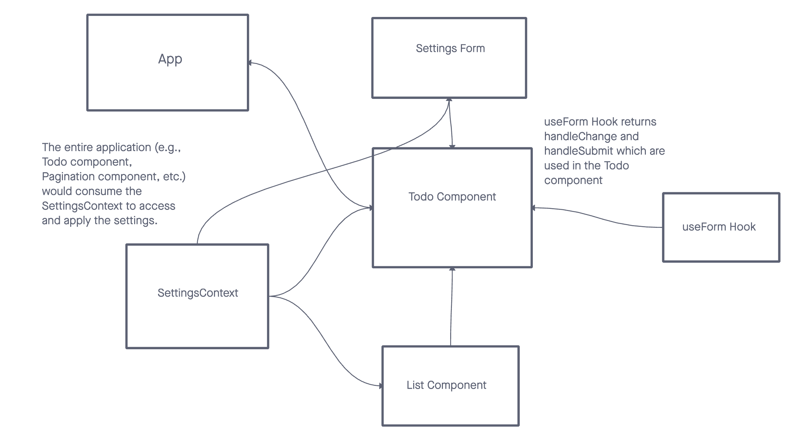

# todo-app

## How Global State is Consumed by the Components

In React, the Context API provides a mechanism to share data across components without prop-drilling.

1. **Creating Context**: Begin with `React.createContext()` to get a Provider and a Consumer.
2. **Creating a Provider**: Embed the global state within a component that uses the Provider. This component also offers methods to update this state.
3. **Consuming the State**: Components can access or modify the global state using the useContext hook.

## The operation of the hook: useForm()

- Initialization: Form data starts empty using useState.
- handleSubmit: Prevents default form submission and activates a callback with current form values.
- handleChange: Updates values based on input changes. Supports standard inputs and a custom 'difficulty' slider. Numeric values get parsed.
- Default Values with useEffect: When defaultValues change, the form updates.
- Return Values: The hook returns handleChange, handleSubmit, and current form values. It effectively manages form state.

## URLs:

- 
- [PR1](https://github.com/KatKho/todo-app/pull/1)
- [PR2](https://github.com/KatKho/todo-app/pull/2)
- [PR3](https://github.com/KatKho/todo-app/pull/3)
- [PR4](https://github.com/KatKho/todo-app/pull/4)

## Contributors

- Ekaterina Khoroshilova
- ChatGPT has been utilized for test
  
